# Automatic-Palletizing-Robotic-Station-with-PLC-Control

  

---

## 📊 Project Overview

[-green.svg)](https://unity.com/)

**OP70** is an automated rejection handling and palletizing cell developed for a ficticious Operation 70 (OP70) on Line 4 at Advance Motors AB's ficticious engine plant in Skövde, Sweden. The system processes engine cylinder heads, automatically extracting rejected units identified in OP60 and transferring them to Euro pallets without manual intervention. 

The cell acts as the final operation on Line 4. Accepted parts pass through directly to the next operation, while rejected engine heads are redirected to an automated palletizing zone.

---

## 🎬 Visual Demonstration

📦 <b>Click here to expand the visual demonstration</b>

📦 <b>Click here to expand the execution videos</b>

---

📦 <b>Click here to expand the robotic cell images</b>

  General cell layout:
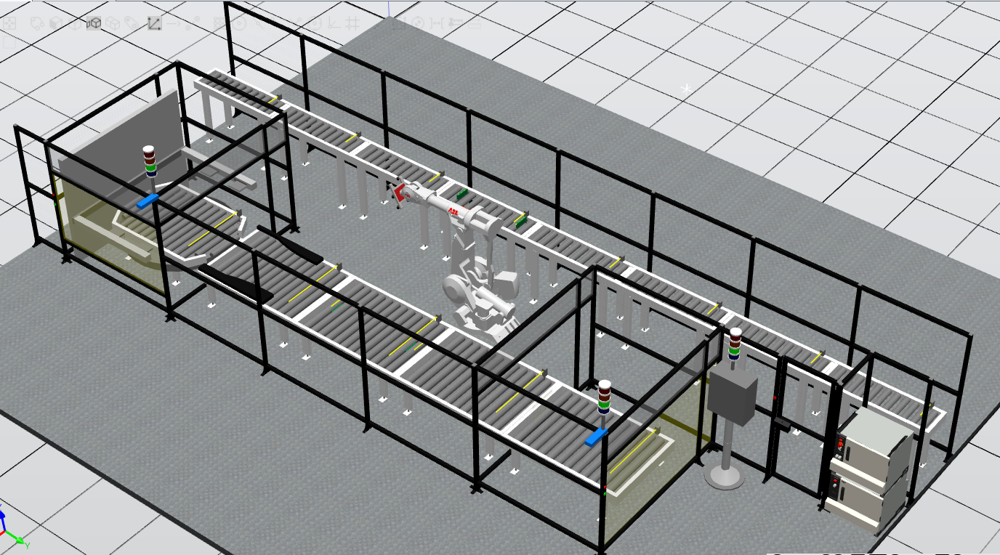
  
  Close-up of the robot operation area:
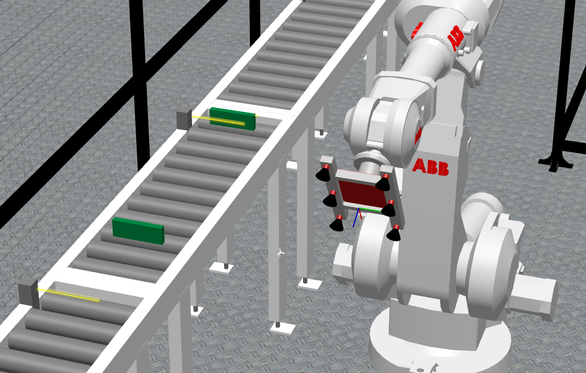
  
  Safety gate 1 with outer light gate muted:
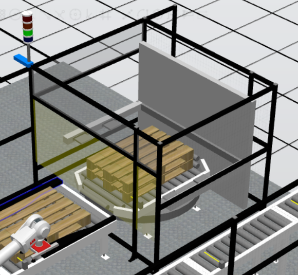
  
  Safety gate 1 with inner light gate muted:
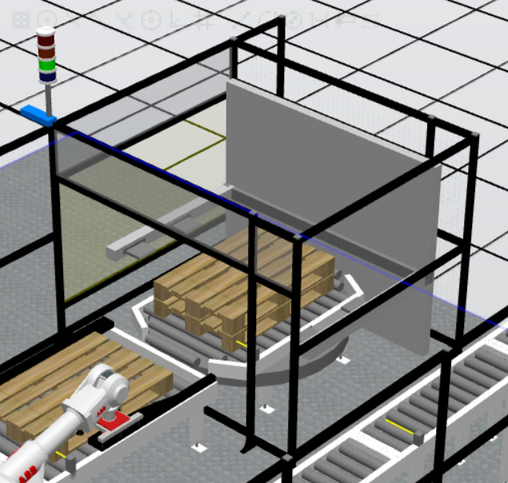

  Safety gate 2 with outer light gate muted:
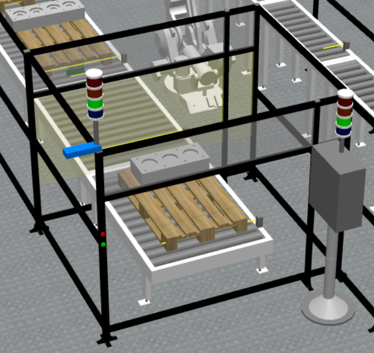

  Safety gate 2 with inner light gate muted:
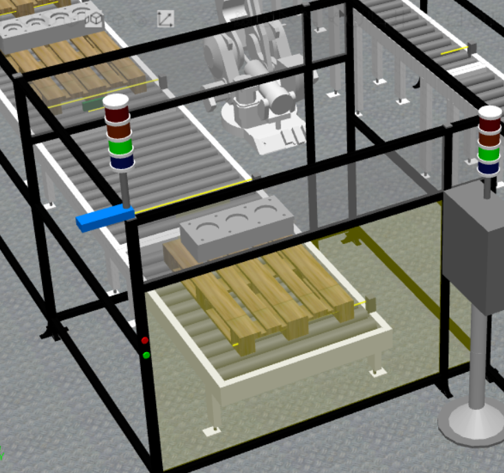

---

📦 <b>Click here to expand the PLC panel images</b>

  
  Operator panel 1:
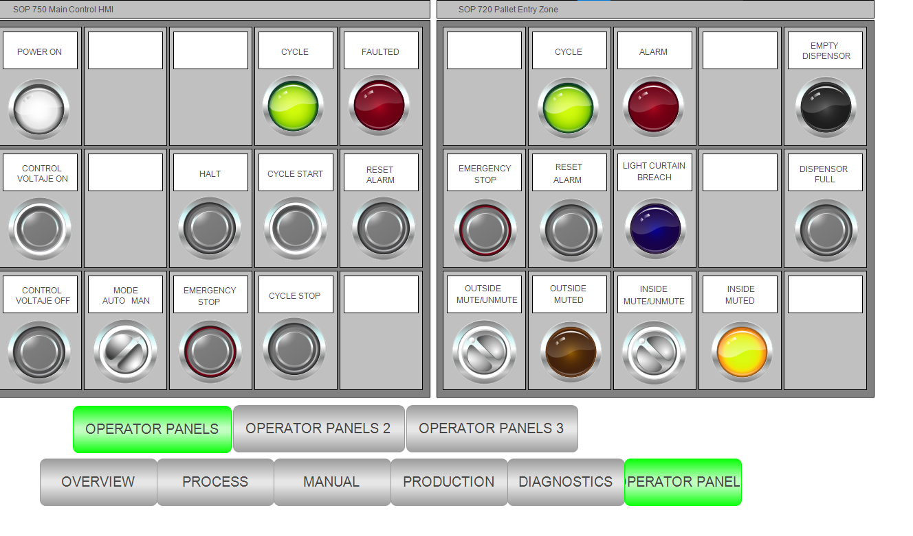
  
  Operator panel 2:
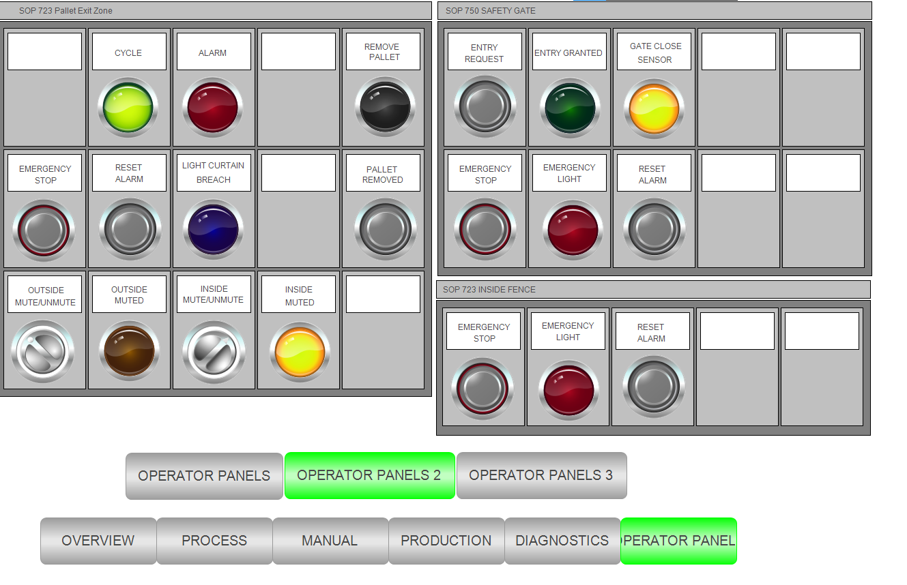
  
  Operator panel 3:
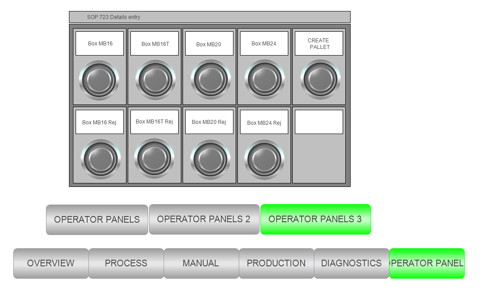
  
  Disgnostic panel:
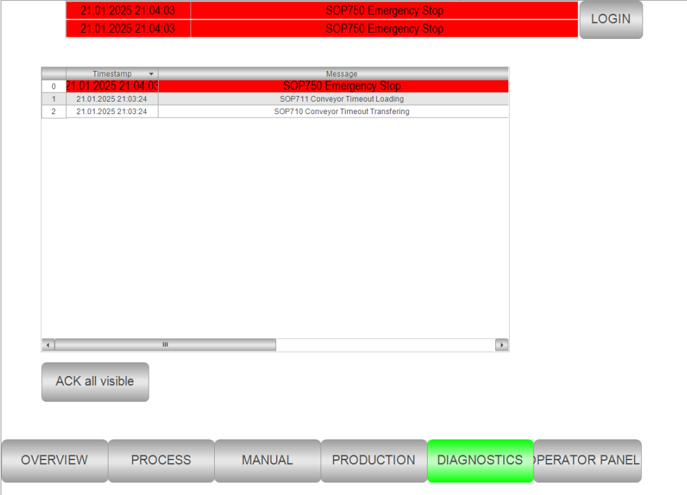
  
  Production panel:
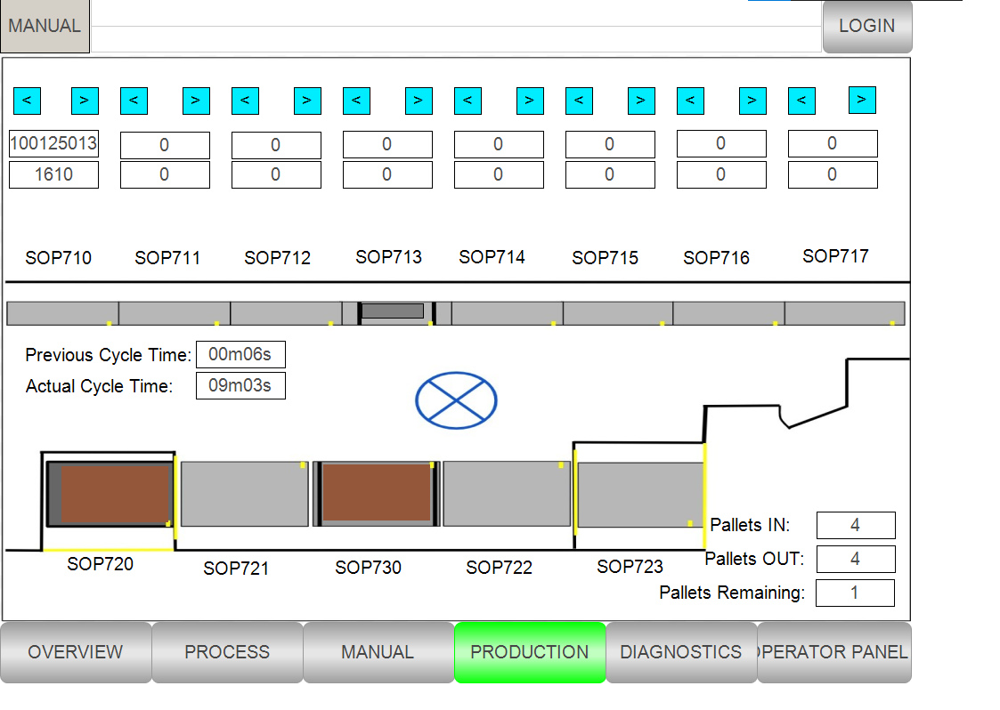
  
  Manual operation panel 3 (SOP714 to SOP717):
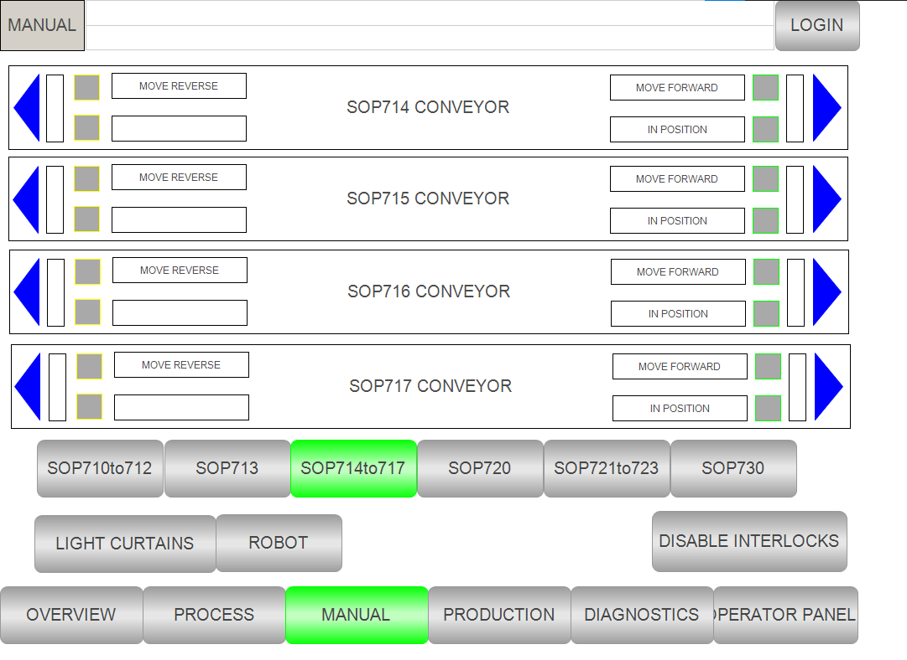
  
  Manual operation panel 4 (SOP720):
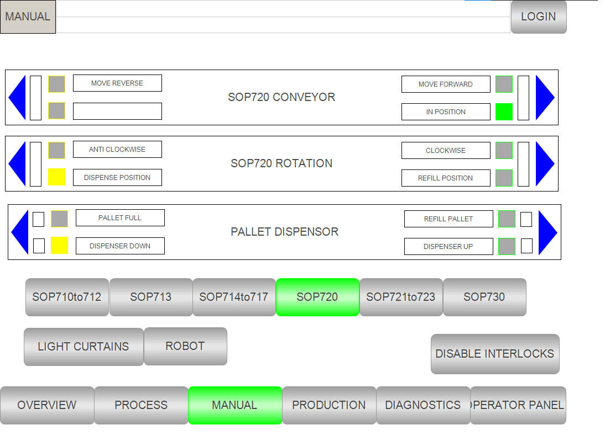
  
  Process panel:
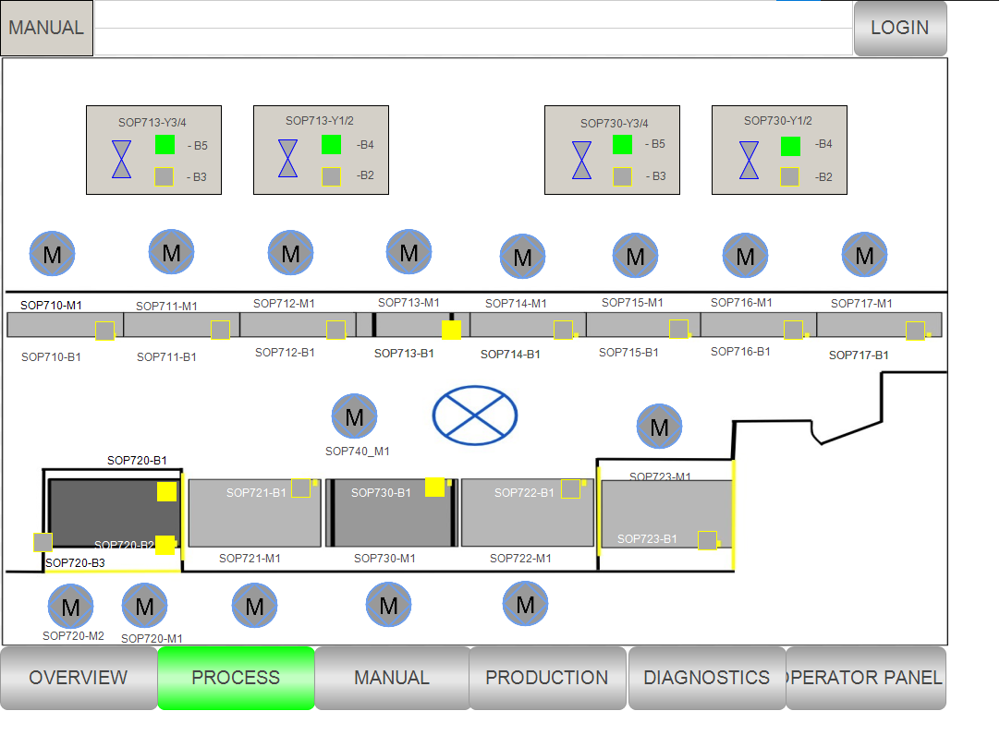
  
  Overview panel:
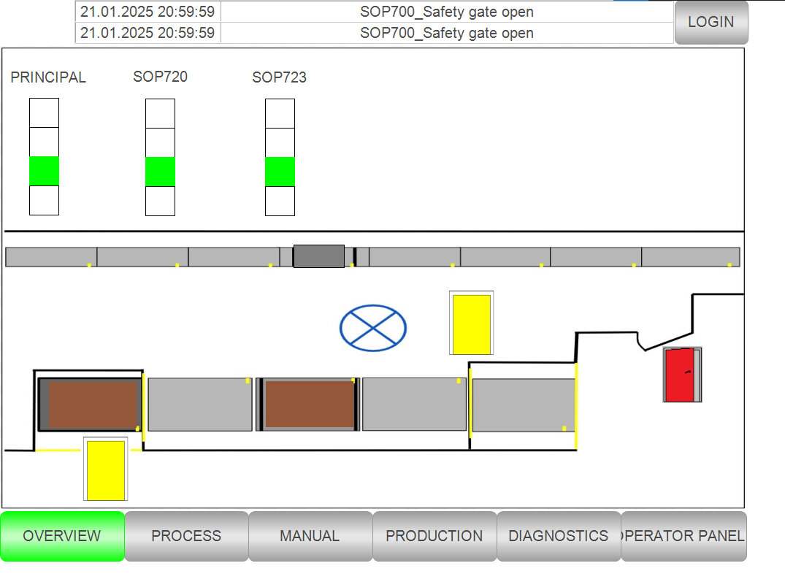
  

---

  Virtual environment painting:

  Physical environment painting: 

  Physical environment painting 2: 

## 🛠️ Technical Specifications

### 💻 Software Stack
* **CODESYS v3.5 Control System**: Full PLC simulation including HMI/visual panels.
* **RobotStudio**: Full robotic cell simulation including safety integrations and I/O modules.
* **FluidSIM**: Electrical diagrams including PLC and safety integrations.

---

## 📁 Project Structure & Code Architecture

This repository is organized into four distinct development phases tracking the lifecycle of the project from initial scoping to final virtual validation.

- Phase 1: Project Scope & Architecture Setup
  - Definition of functional requirements, station operational sequences, and hardware/software selection.
  - Initial mapping of control interfaces and cell safety boundaries.

- Phase 2: Design Review - Base System Design & Cell Layout
  - Early 3D layout of the OP70 station in ABB RobotStudio.
  - Preliminary electrical schematics and basic PLC POU structures in CODESYS.

- Phase 3: FAT - Deep Refinement & Detailed Schematics
  - Complete electrical schematic sets (.prj), detailed I/O signal lists (.xlsx), and packed RobotStudio functional station assets (.rspag).
  - Safety system integration (E-Stops, light curtains, interlocks) and signal mapping.

- Phase 4: SAT - Final Integration & Functional Execution
  - Production-ready OP70 Robot Program with motion paths and handshake logic.
  - Complete OP70 PLC Project in CODESYS including full HMI/Visualization Control Panels.
  - RobotStudio OPC-UA Configuration (.csv) mapping node addresses for virtual hardware communication.

### Subsystem Breakdown & Simulation Architecture

Because this project serves as a comprehensive fictitious case study, physical hardware is entirely modeled through digital twin techniques. The cell relies on software-in-the-loop (SIL) co-simulation between CODESYS (acting as the master PLC) and ABB RobotStudio (acting as the robotic workstation and physical cell physics simulator).

📦 <b>Click here to expand the detailed architecture</b>

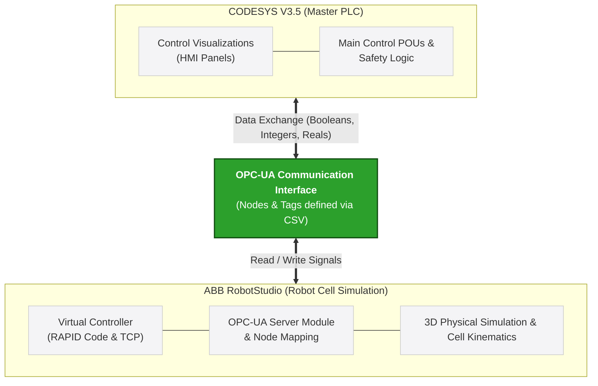
---

1. Master Control Subsystem (CODESYS PLC & Visualizations)

- PLC Logic (POUs): Runs the main state machines, station cycle timing, fault management, and safety interlocks.
- HMI Visualizations: Includes multiple interactive control panels for manual operation, automatic mode execution, sensor feedback monitoring, and alarms.

2. Robotic & Physical Cell Subsystem (ABB RobotStudio)
- Virtual Controller & Kinematics: Executes the finished RAPID code, controlling robot paths, tool center points (TCP), and station actuators (grippers, fixtures, conveyors).
- Physics & Smart Components: Simulates part presence sensors, pneumatic clamp movements, and physical part collisions.

3. Inter-System Connectivity (OPC-UA Data Exchange)
The link between CODESYS and RobotStudio is handled seamlessly via OPC-UA:
- OPC-UA Server: RobotStudio hosts a built-in virtual OPC-UA server node.
- Tag Configuration: The uploaded RobotStudio OPC UA Configuration File (.csv) registers the tags, data types (Booleans, Integers, Reals), and directionality.
- CODESYS Client Integration: CODESYS connects to the RobotStudio OPC-UA endpoint using configured Global Variable Lists (GVL). Signals such as Start_Cycle, Robot_In_Home, Gripper_Close, and Safety_Ok are exchanged deterministically in real time to synchronize the station.

---

🚀 Quick Start & Execution Guide

1. Configure RobotStudio Station & OPC-UA Server
   - Open ABB RobotStudio and open or import the OP70_Robot_Program.
   - Navigate to the *Controller* tab $\rightarrow$ *OPC-UA Configuration*.
   - Import the RobotStudio_OPC_UA_Configuration_File.csv to register all published I/O tags, nodes, and data types.
   - Start the Virtual Controller and verify the OPC-UA Server status shows Active.
2. Configure CODESYS PLC & Communication
   - Open CODESYS and open the OP70_PLC project.
   - Go to *Device Tree* $\rightarrow$ *Symbol Configuration / OPC UA Client Manager*.
   - Verify the endpoint URI matches your local RobotStudio OPC-UA server address.
   - Build the project to ensure there are no compilation errors or missing tag references.
3. Launch Simulation & Co-Simulation
   - In RobotStudio, click *Play* on the simulation ribbon to start physical cell physics and station monitoring.
   - In CODESYS, click *Login* to connect to the active PLC runtime, then click *Start*.
   - Open the *Control Panel Visualizations* in CODESYS to trigger system execution.
---

This system has been developed as a project in collaboration with Aitor Sagarna Zabala, Paula Bolívar Pérez and Selene Delgado Pastor.
