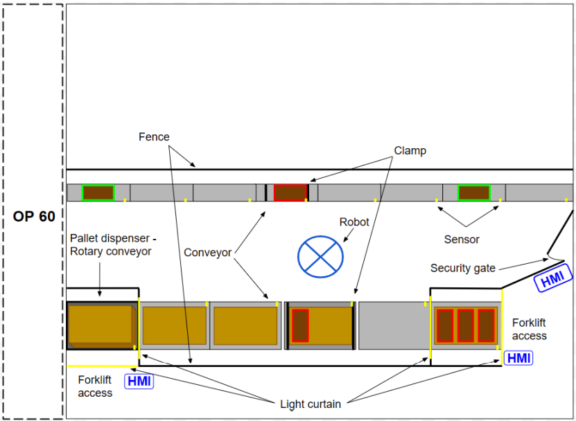

**Planning and creating a quotation**
---
### Inquiry OP070
  This is the formal inquiry specification document issued by the fictitious Advance Motors AB detailing the requirements for the Operation 70 (OP70) rejection and palletizing cell. 
  * Project Overview: Background on Line 4, project milestones, and delivery location.
  * Technical Specifications: Description of part processing flow, performance requirements, cell layout, equipment parameters, product models, and batch sizes.
  * Safety: Requirements for emergency stops, safety stops, and safety zone access/exit procedures.
  * Control System and HMI: Specifications for PLCs, ABB robots, control panels, gate panels, light beacons, and screen layouts/navigation.
  * Functional Description: Startup routines, operating modes (Manual, Automatic), and restart protocols.
  * Alarm Functions: Alarm levels (Faults, Warnings, Messages) and handling guidelines.
  * Project Logistics: Deliverables, FAT/SAT procedures, delivery/training requirements, and payment terms. 
  * Attachment A: Product CAD drawings for the engine cylinder head variants.
---
## OP70 Quotation
  
  This is the formal proposal submitted by the fictitious InterWilds Robotics in response to Advance Motors' inquiry, outlining their turnkey solution and commercial agreement.
  * Changes Applied After Quotation Review: Design updates based on initial reviews (e.g., adding clamping mechanisms, conveyor layout adjustments, light curtains).
  * Project Scope & Specifications: Project boundary, installation location, capacity goals, and system performance metrics.
  * Time Plan: Key project completion dates and milestones.
  * Commercial Terms: Pricing breakdown for components/services, payment schedule, supplementary work rate cards, and warranty conditions.
  * Technical Description: Detailed cell physical layout, conveyor flow, clamp systems, and safety light curtains.
  * Project Execution: Timeline chart, testing protocols, commitments, compatible products, training, safety functions, and deliverables.
  * CE-Marking: Scope of CE certification for the supplied cell.
---

📦 <b>Click here to expand the representation of the initial cell layout</b>

  

