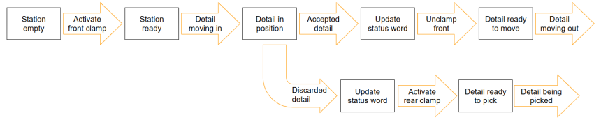
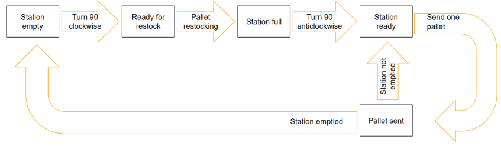
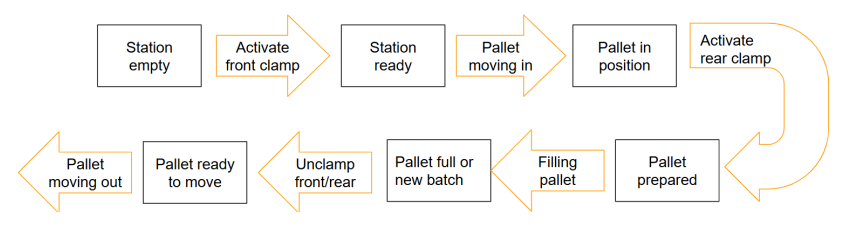
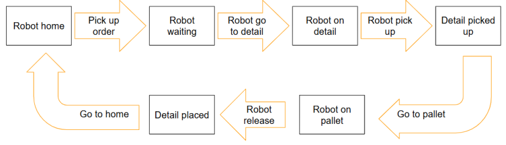
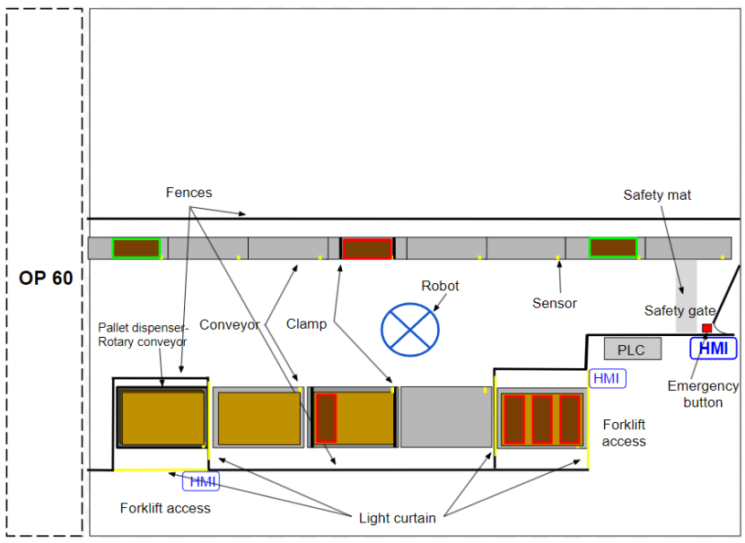
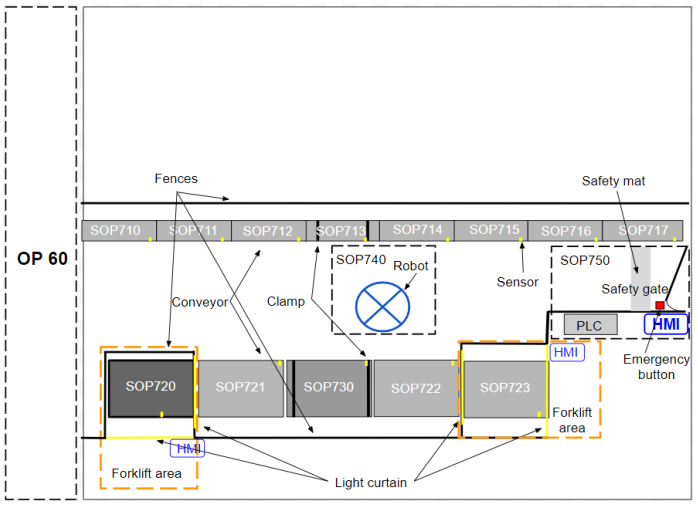

**Design Review**
---
### Functional Description OP70
  This document, provided by InterWilds Robotics, outlines the technical and functional design specifications for the Advance Motors - Line 4 OP70 rejection and palletizing cell.
  * Revision Control: Tracks document revisions, noting initial creation on 2024-12-06.
  * System Overview: Details the cell arrangement comprising 6 motorized conveyors (running at 15m/min), a rotary pallet dispenser, pneumatic clamps, buffer tracks, 2.5m high safety perimeter fences, safety mats, and double-action light curtains at forklift entry zones.
  * Sub-Operations Breakdown:
    - SOP710–SOP717: Main production line conveyors 1 to 8 receiving parts from OP60.
    - SOP720–SOP723: Pallet handling conveyors and buffer stations, including forklift access zones.
    - SOP730: Defective part rejection conveyor equipped with clamping systems.
    - SOP740: ABB Robot handling zone.
    - SOP750: Safety enclosure, access gate, main electrical/pneumatic cabinet, and primary PLC control area.
- Conveyor System & Data Exchange:Explains single and bi-directional contactor controls and inductive sensor placements. Defines production data structures tracked per part (Product Number [16-bit], ID Number [32-bit], and Status [16-bit word]). Outlines the standard handshaking binary interlock protocol (ReadyToSend, ReadyToReceive, Sending, ProductReceived) for transferring parts safely across conveyors.
- SOP713 Workflow: Describes part positioning, double-acting pneumatic clamping sequence, status updating, and transfer/pick conditions for accepted or rejected cylinder heads.
      

      
<b>Click here to expand the Flow chart for SOP713</b>

      

        
      

      

- SOP720 Forklift Area: Outlines operation of the 90° rotary pallet dispenser, empty-stack detection, pallet separation, and muting sequences for external/internal safety light curtains.
    

    
<b>Click here to expand the Flow chart for SOP720</b>

    

      
    

    

- SOP730 Reject Station: Details the clamping logic and sequencing for holding pallet targets stationary during part loading.
    

    
<b>Click here to expand the Flow chart for SOP730</b>

    

      
    

    

- SOP740 Pick & Place Robot: Maps out the exact motion and handshaking steps.
    

    
<b>Click here to expand the Flow chart for SOP740</b>

    

      
    

    

- SOP750 Safety & Cabinet Details: Specifies safety interlocks, safety mat monitoring inside the perimeter gate, main electrical distribution, pneumatic manifolds, circuit protection, and system-wide PLC alarm routines.
---

📦 <b>Click here to expand the final cell layout proposals</b>

  Final cell layout proposal
  
  

  Final cell layout suboperations proposal
  
  

